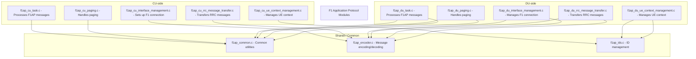

```mermaid
graph TB
    %% Title
    A[F1 Application Protocol Modules]

    %% CU Side
    subgraph B[CU-side]
        B1[f1ap_cu_task.c - Processes F1AP messages]
        B2[f1ap_cu_interface_management.c - Sets up F1 connection]
        B3[f1ap_cu_ue_context_management.c - Manages UE context]
        B4[f1ap_cu_rrc_message_transfer.c - Transfers RRC messages]
        B5[f1ap_cu_paging.c - Handles paging]
    end

    %% DU Side
    subgraph C[DU-side]
        C1[f1ap_du_task.c - Processes F1AP messages]
        C2[f1ap_du_interface_management.c - Manages F1 connection]
        C3[f1ap_du_ue_context_management.c - Manages UE context]
        C4[f1ap_du_rrc_message_transfer.c - Transfers RRC messages]
        C5[f1ap_du_paging.c - Handles paging]
    end

    %% Shared/Common Components
    subgraph D[Shared / Common]
        D1[f1ap_common.c - Common utilities]
        D2[f1ap_encoder.c - Message encoding/decoding]
        D3[f1ap_ids.c - ID management]
    end

    %% Connections
    B1 --> D1
    B2 --> D2
    B3 --> D3
    B4 --> D2
    B5 --> D1

    C1 --> D1
    C2 --> D2
    C3 --> D3
    C4 --> D2
    C5 --> D1


    C1 --> D1
    C2 --> D2
    C3 --> D3
    C4 --> D2
    C5 --> D1
```
