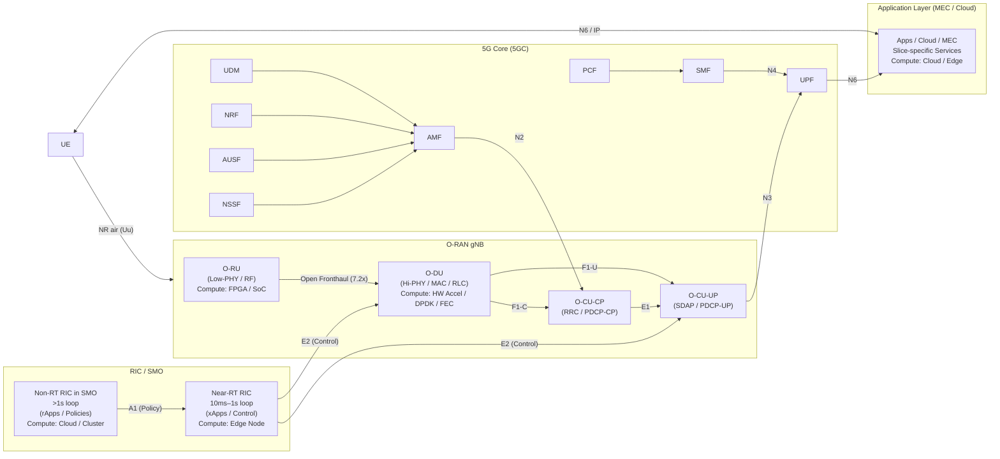

```mermaid
flowchart LR
    UE[UE] -- "NR air (Uu)" --> RAN

    %% -------------------- RAN --------------------
    subgraph RAN["O-RAN gNB"]
        RU["O-RU\n(Low-PHY / RF)\nCompute: FPGA / SoC"]
        DU["O-DU\n(Hi-PHY / MAC / RLC)\nCompute: HW Accel / DPDK / FEC"]
        CUCP["O-CU-CP\n(RRC / PDCP-CP)"]
        CUUP["O-CU-UP\n(SDAP / PDCP-UP)"]

        RU -- "Open Fronthaul (7.2x)" --> DU
        DU -- "F1-C" --> CUCP
        DU -- "F1-U" --> CUUP
        CUCP -- "E1" --> CUUP
    end

    %% -------------------- RIC / SMO --------------------
    subgraph RIC_SMO["RIC / SMO"]
        NRT["Non-RT RIC in SMO\n>1s loop\n(rApps / Policies)\nCompute: Cloud / Cluster"]
        NRTIC["Near-RT RIC\n10ms–1s loop\n(xApps / Control)\nCompute: Edge Node"]

        NRT -- "A1 (Policy)" --> NRTIC
        NRTIC -- "E2 (Control)" --> DU
        NRTIC -- "E2 (Control)" --> CUUP
    end

    %% -------------------- 5G CORE --------------------
    subgraph Core["5G Core (5GC)"]
        AMF[AMF]
        SMF[SMF]
        UPF[UPF]
        PCF[PCF]
        UDM[UDM]
        NRF[NRF]
        AUSF[AUSF]
        NSSF[NSSF]

        AMF -- "N2" --> CUCP
        SMF -- "N4" --> UPF
        CUUP -- "N3" --> UPF
        UDM --> AMF
        PCF --> SMF
        NRF --> AMF
        AUSF --> AMF
        NSSF --> AMF
    end

    %% -------------------- APPLICATION LAYER --------------------
    subgraph MEC["Application Layer (MEC / Cloud)"]
        APP["Apps / Cloud / MEC\nSlice-specific Services\nCompute: Cloud / Edge"]
    end

    UE <-- "N6 / IP" --> APP
    UPF -- "N6" --> APP
```
