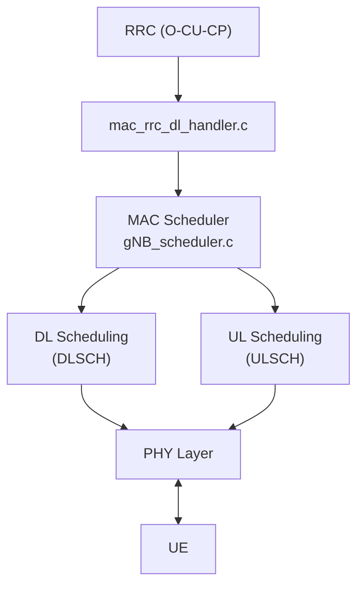

```mermaid
flowchart TD
    RRC["RRC (O-CU-CP)"]
    MAC_HDLR["mac_rrc_dl_handler.c"]
    SCHED["MAC Scheduler\ngNB_scheduler.c"]
    DL["DL Scheduling\n(DLSCH)"]
    UL["UL Scheduling\n(ULSCH)"]
    PHY["PHY Layer"]
    UE["UE"]

    RRC --> MAC_HDLR --> SCHED
    SCHED --> DL
    SCHED --> UL
    DL --> PHY
    UL --> PHY
    PHY <--> UE
```
