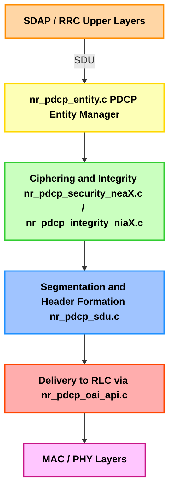

```mermaid
flowchart TD
    A[SDAP / RRC Upper Layers] -->|SDU| B[nr_pdcp_entity.c PDCP Entity Manager]
    B --> C[Ciphering and Integrity nr_pdcp_security_neaX.c / nr_pdcp_integrity_niaX.c]
    C --> D[Segmentation and Header Formation nr_pdcp_sdu.c]
    D --> E[Delivery to RLC via nr_pdcp_oai_api.c]
    E --> F[MAC / PHY Layers]

    %% Vibrant, high-contrast colors
    style A fill:#FFD6A5,stroke:#FF8C00,stroke-width:2px,color:#000,font-weight:bold
    style B fill:#FDFFB6,stroke:#FFD700,stroke-width:2px,color:#000,font-weight:bold
    style C fill:#CAFFBF,stroke:#32CD32,stroke-width:2px,color:#000,font-weight:bold
    style D fill:#A0C4FF,stroke:#1E90FF,stroke-width:2px,color:#000,font-weight:bold
    style E fill:#FFADAD,stroke:#FF4500,stroke-width:2px,color:#000,font-weight:bold
    style F fill:#FFC6FF,stroke:#C71585,stroke-width:2px,color:#000,font-weight:bold
```
