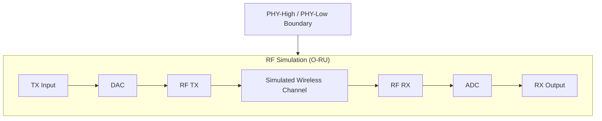

```mermaid
flowchart TD
    A[PHY-High / PHY-Low Boundary] --> B["RF Simulation (O-RU)"]

    subgraph B["RF Simulation (O-RU)"]
        TX["TX Input"]
        DAC["DAC"]
        RFTX["RF TX"]
        CH["Simulated Wireless Channel"]
        RFRX["RF RX"]
        ADC["ADC"]
        RX["RX Output"]

        TX --> DAC --> RFTX --> CH
        CH --> RFRX --> ADC --> RX
    end
```
