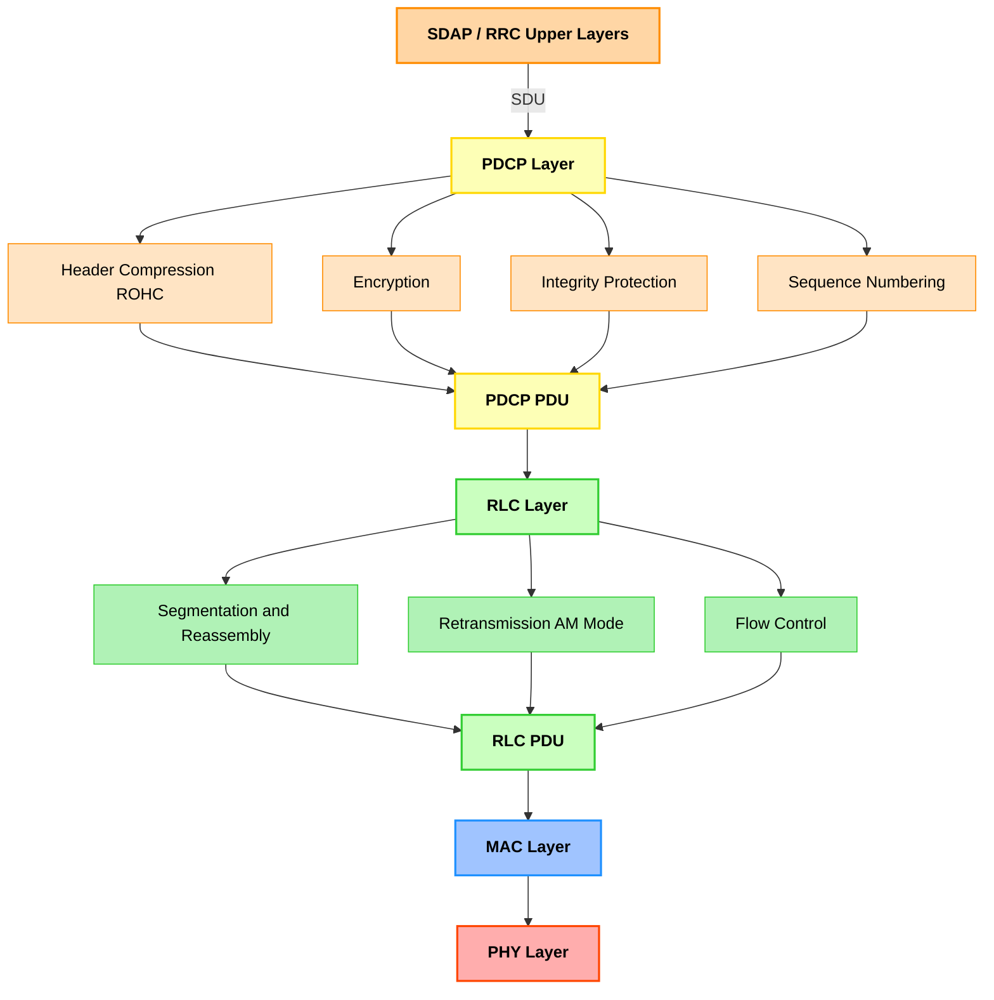

```mermaid
flowchart TD
    %% Upper Layers
    A[SDAP / RRC Upper Layers] -->|SDU| B[PDCP Layer]
    
    %% PDCP Layer operations
    B --> B1[Header Compression ROHC]
    B --> B2[Encryption]
    B --> B3[Integrity Protection]
    B --> B4[Sequence Numbering]
    B1 --> B5[PDCP PDU]
    B2 --> B5
    B3 --> B5
    B4 --> B5

    %% RLC Layer operations
    B5 --> C[RLC Layer]
    C --> C1[Segmentation and Reassembly]
    C --> C2[Retransmission AM Mode]
    C --> C3[Flow Control]
    C1 --> C4[RLC PDU]
    C2 --> C4
    C3 --> C4

    %% MAC and PHY
    C4 --> D[MAC Layer]
    D --> E[PHY Layer]

    %% Styling - High-contrast colors
    style A fill:#FFD6A5,stroke:#FF8C00,stroke-width:2px,color:#000,font-weight:bold
    style B fill:#FDFFB6,stroke:#FFD700,stroke-width:2px,color:#000,font-weight:bold
    style B1 fill:#FFE4C4,stroke:#FF8C00,stroke-width:1px,color:#000
    style B2 fill:#FFE4C4,stroke:#FF8C00,stroke-width:1px,color:#000
    style B3 fill:#FFE4C4,stroke:#FF8C00,stroke-width:1px,color:#000
    style B4 fill:#FFE4C4,stroke:#FF8C00,stroke-width:1px,color:#000
    style B5 fill:#FDFFB6,stroke:#FFD700,stroke-width:2px,color:#000,font-weight:bold
    style C fill:#CAFFBF,stroke:#32CD32,stroke-width:2px,color:#000,font-weight:bold
    style C1 fill:#B0F2B6,stroke:#32CD32,stroke-width:1px,color:#000
    style C2 fill:#B0F2B6,stroke:#32CD32,stroke-width:1px,color:#000
    style C3 fill:#B0F2B6,stroke:#32CD32,stroke-width:1px,color:#000
    style C4 fill:#CAFFBF,stroke:#32CD32,stroke-width:2px,color:#000,font-weight:bold
    style D fill:#A0C4FF,stroke:#1E90FF,stroke-width:2px,color:#000,font-weight:bold
    style E fill:#FFADAD,stroke:#FF4500,stroke-width:2px,color:#000,font-weight:bold


```
