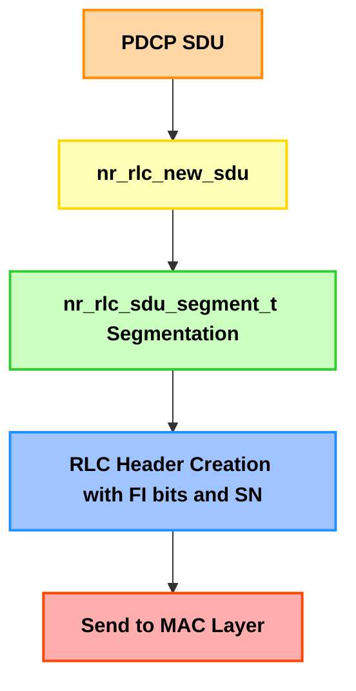

```mermaid
flowchart TD
    A[PDCP SDU] --> B[nr_rlc_new_sdu]
    B --> C[nr_rlc_sdu_segment_t Segmentation]
    C --> D[RLC Header Creation with FI bits and SN]
    D --> E[Send to MAC Layer]

    %% Vibrant, high-contrast colors
    style A fill:#FFD6A5,stroke:#FF8C00,stroke-width:2px,color:#000,font-weight:bold
    style B fill:#FDFFB6,stroke:#FFD700,stroke-width:2px,color:#000,font-weight:bold
    style C fill:#CAFFBF,stroke:#32CD32,stroke-width:2px,color:#000,font-weight:bold
    style D fill:#A0C4FF,stroke:#1E90FF,stroke-width:2px,color:#000,font-weight:bold
    style E fill:#FFADAD,stroke:#FF4500,stroke-width:2px,color:#000,font-weight:bold


```
