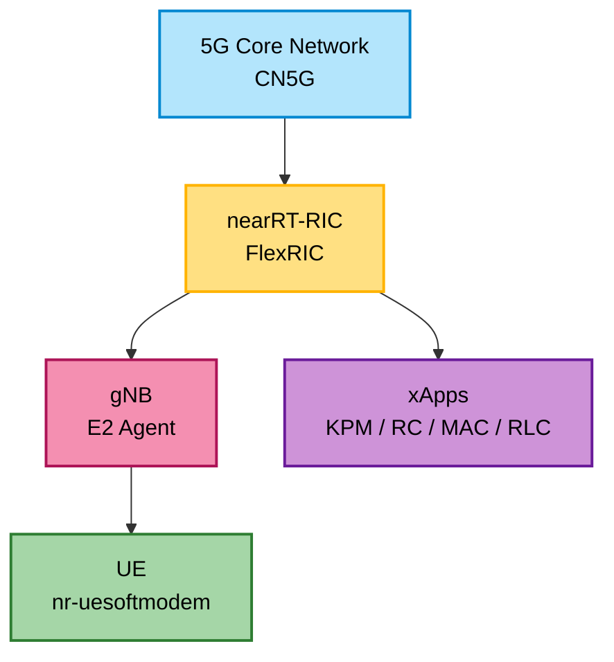

# 🛰️ OpenAirInterface 5G Full Stack Setup Guide

> **A Complete Deployment Guide for Beyond 5G Research**  
> RIC + gNB + UE + CN5G Integration

<div align="center">

[](https://openairinterface.org/)
[](https://gitlab.eurecom.fr/mosaic5g/flexric)
[](https://www.docker.com/)

</div>

---

## 📋 Table of Contents
- [GUI-Fix](#gui-fix)
- [Overview](#-overview)
- [Pre-requisites](#️-section-1-pre-requisites)
- [Build SWIG](#-section-2-build-swig)
- [Build OAI with E2](#️-section-3-build-oai-with-e2-support)
- [Build FlexRIC](#-section-4-build-and-install-flexric)
- [Setup CN5G Core](#-section-5-setup-oai-5g-core-cn5g)
- [Start RIC & gNB](#️-section-6-start-nearrt-ric-and-oai-gnb)
- [Synchronization](#-section-7-synchronization-setup)
- [Start UE](#-section-8-start-oai-ue)
- [Run xApps](#-section-9-run-xapps)
- [Future Work](#-section-10-custom-ml-xapp-future-work)
- [Results](#-section-11-result)
- [Cleanup](#-stopping-all-containers)
- [References](#-references)

---
### GUI-Fix
- This error happens due to broken package installations.
- Fix using three simple commands:
```bash
sudo apt -f install
sudo apt update
sudo apt install --reinstall ubuntu-desktop
```
- Then reboot the system from command line
```bash
reboot
```
## 🌟 Overview

This repository provides a **complete, reproducible setup** for the **OpenAirInterface (OAI) 5G Full Stack**, enabling research in:

- 🔷 **Network Slicing**
- 🔷 **RAN Intelligent Controller (RIC) Integration**
- 🔷 **xApp Development**
- 🔷 **Beyond 5G (B5G) Use Cases**

### 🔗 Repository References

| Component | Repository |
|-----------|-----------|
| **OAI 5G RAN** | [openairinterface5g](https://gitlab.eurecom.fr/oai/openairinterface5g) |
| **OAI CN5G** | [oai-cn5g-fed](https://gitlab.eurecom.fr/oai/cn5g/oai-cn5g-fed) |
| **FlexRIC** | [mosaic5g/flexric](https://gitlab.eurecom.fr/mosaic5g/flexric) |

---

## 🏗️ Architecture



---

## ⚙️ Section 1: Pre-requisites

### 🖥️ System Preparation

Update your system packages:

```bash
sudo apt update -y
sudo apt upgrade -y
```

### 🧰 Build Essentials and GCC 13

Install development tools and configure GCC 13:

```bash
sudo apt install -y build-essential
sudo apt install -y gcc-13 g++-13 cpp-13
sudo update-alternatives --install /usr/bin/gcc gcc /usr/bin/gcc-13 100 \
  --slave /usr/bin/g++ g++ /usr/bin/g++-13 \
  --slave /usr/bin/gcov gcov /usr/bin/gcov-13
sudo update-alternatives --config gcc
```

**Verify installation:**

```bash
gcc --version
g++ --version
```

### 🧪 Network Analysis Tools

```bash
sudo apt install -y wireshark tcpdump
```

#### 📊 Wireshark SCTP Configuration

Configure Wireshark for E2AP protocol analysis:

1. Open Wireshark → **Analyze** > **Decode As**
2. Set the following:
   - **Field:** `SCTP Port`
   - **Value:** `36421`
   - **Current:** `E2AP protocol`
3. Click **OK**

### 🧱 Additional Dependencies

```bash
sudo apt install -y libsctp-dev cmake-curses-gui libpcre2-dev
```

---

## 🧩 Section 2: Build SWIG

SWIG enables multi-language xApp support:

```bash
git clone https://github.com/swig/swig.git
cd swig
git checkout release-4.1
./autogen.sh
./configure --prefix=/usr/
make -j8
sudo make install
```

**Verify installation:**

```bash
swig -version
```

**Install Python development headers:**

```bash
sudo apt install python3-dev
```

---

## 🏗️ Section 3: Build OAI with E2 Support

### 📥 Clone OAI Repository

```bash
cd ~/OAI
git clone https://gitlab.eurecom.fr/oai/openairinterface5g
cd openairinterface5g/cmake_targets/
```

### 📦 Install Dependencies

```bash
./build_oai -I
```

### 🔨 Build with E2 Agent and FlexRIC

```bash
./build_oai --gNB --nrUE --build-e2 \
  --cmake-opt -DE2AP_VERSION=E2AP_V2 \
  --cmake-opt -DKPM_VERSION=KPM_V2_03 \
  --ninja
```

> **Note:** This builds both gNB and UE with E2 Agent support for RIC integration.

---

## 🧠 Section 4: Build and Install FlexRIC

### 📥 Initialize FlexRIC Submodule

```bash
cd ~/OAI/openairinterface5g/openair2/E2AP/flexric
git submodule init && git submodule update
```

### 🔨 Build FlexRIC

```bash
mkdir build && cd build
cmake -DXAPP_MULTILANGUAGE=ON ..
make -j8
sudo make install
```

### ✅ Run Tests

```bash
ctest -j8 --output-on-failure
```

---

## 🧭 Section 5: Setup OAI 5G Core (CN5G)

### 🐳 Install Docker and Docker Compose

```bash
# Install prerequisites
sudo apt install -y git net-tools putty ca-certificates curl

# Setup Docker GPG key
sudo install -m 0755 -d /etc/apt/keyrings
sudo curl -fsSL https://download.docker.com/linux/ubuntu/gpg \
  -o /etc/apt/keyrings/docker.asc
sudo chmod a+r /etc/apt/keyrings/docker.asc

# Add Docker repository
echo "deb [arch=$(dpkg --print-architecture) signed-by=/etc/apt/keyrings/docker.asc] \
  https://download.docker.com/linux/ubuntu \
  $(. /etc/os-release && echo "${UBUNTU_CODENAME:-$VERSION_CODENAME}") stable" | \
  sudo tee /etc/apt/sources.list.d/docker.list > /dev/null

# Install Docker
sudo apt update
sudo apt install -y docker-ce docker-ce-cli containerd.io \
  docker-buildx-plugin docker-compose-plugin

# Add user to docker group
sudo usermod -a -G docker $(whoami)
reboot
```

### 📦 Deploy CN5G Core Network

```bash
# Download OAI CN5G resources archive
wget -O ~/oai-cn5g.zip "https://gitlab.eurecom.fr/oai/openairinterface5g/-/archive/develop/openairinterface5g-develop.zip?path=doc/tutorial_resources/oai-cn5g"

# Unzip and move to your working directory
unzip ~/oai-cn5g.zip
mv ~/OAI/openairinterface5g-develop-doc-tutorial_resources-oai-cn5g/doc/tutorial_resources/oai-cn5g ~/OAI/oai-cn5g

# Clean up unnecessary files
rm -r ~/openairinterface5g-develop-doc-tutorial_resources-oai-cn5g ~/oai-cn5g.zip
```

**Start the core network with slicing support:**

```bash
cd ~/OAI/oai-cn5g
sudo docker compose up -d
```
Note: If you have used alternate docker installation use docker-compose in command instead of docker compose

### ✅ Verify Deployment

**Check running containers:**

```bash
docker ps
```
**Check the logs of the containers:**
```bash
docker compose logs
```
**Core Network Startup**


---

## 🛰️ Section 6: Start nearRT-RIC and OAI gNB

### 🔹 Terminal 1: Start nearRT-RIC

```bash
cd ~/OAI/openairinterface5g/openair2/E2AP/flexric/build/examples/ric
./nearRT-RIC
```
**Near-RT RIC Connected**


> **💡 Tip:** Keep this terminal open to monitor RIC logs.

### 🔹 Terminal 2: Start OAI gNB (E2 Agent Enabled)

```bash
cd ~/OAI/openairinterface5g/cmake_targets/ran_build/build
sudo ./nr-softmodem \
  -O ~/OAI/openairinterface5g/targets/PROJECTS/GENERIC-NR-5GC/CONF/gnb.sa.band78.fr1.106PRB.pci0.rfsim.conf   \
  --rfsim \
  --e2_agent.near_ric_ip_addr 127.0.0.1 \
  --e2_agent.sm_dir /usr/local/lib/flexric/ \
  --gNBs.[0].min_rxtxtime 6
```

> **Note:** The gNB connects to the RIC via E2AP interface.


**GNB Connected**


---

## 📶 Section 7: Synchronization Setup

For hardware RF scenarios, PTP synchronization may be required:

```bash
# Install Linux PTP
sudo apt-get update
sudo apt-get install linuxptp

# Check PTP support on interface
sudo ethtool -T eno1

# Start PTP daemon
sudo ptp4l -m -i eno1

# Synchronize system clock (in another terminal)
sudo phc2sys -s /dev/ptp1 -c CLOCK_REALTIME -w -m -x
```

> **Note:** Replace `eno1` and `/dev/ptp1` with your interface and PTP device.
**Physical Clock Synchronization**

_
---

## 📱 Section 8: Start OAI UE

### 🔹 Terminal 3: Start UE

```bash
cd ~/OAI/openairinterface5g/cmake_targets/ran_build/build
sudo ./nr-uesoftmodem \
  -r 106 --numerology 1 --band 78 -C 3619200000 \
  --rfsim \
  --uicc0.imsi 001010000000001 \
  --rfsimulator.serveraddr 127.0.0.1
```

> **✅ Success Indicator:** Look for "RRC Connected" and PDU session establishment logs.

**UE Connected**


---

## 🧩 Section 9: Run xApps

All xApps should be run from the FlexRIC directory:

```bash
cd ~/OAI/openairinterface5g/openair2/E2AP/flexric
```

### 🧭 KPM Monitor xApp

Monitor Key Performance Metrics:

```bash
XAPP_DURATION=30 ./build/examples/xApp/c/monitor/xapp_kpm_moni
```

**Metrics collected:**
- Throughput (DL/UL)
- PRB utilization
- Active UE count

**Monitoring XAPP Running successfully**


### ⚙️ RC Monitor xApp

Monitor RAN Control parameters:

```bash
XAPP_DURATION=30 ./build/examples/xApp/c/monitor/xapp_rc_moni
```

### 📡 MAC/RLC/PDCP/GTP Monitor xApp

Multi-layer protocol monitoring:

```bash
XAPP_DURATION=30 ./build/examples/xApp/c/monitor/xapp_gtp_mac_rlc_pdcp_moni
```

### 🐍 Python Multi-language xApp

Example of Python-based xApp:

```bash
XAPP_DURATION=30 python3 build/examples/xApp/python3/xapp_mac_rlc_pdcp_gtp_moni.py
```

---

## 🧮 Section 10: Custom ML xApp (Future Work)

### 🎯 Planned Features

Integrate a custom **Traffic Classification ML xApp** for intelligent resource allocation:

#### 📊 Traffic Classification
- **eMBB** (Enhanced Mobile Broadband)
- **URLLC** (Ultra-Reliable Low Latency Communications)
- **mMTC** (Massive Machine Type Communications)

#### 📈 Intelligence Layer
- KPI collection via E2SM-based telemetry
- Reinforcement Learning-based PRB allocation
- Dynamic slice resource optimization
- Real-time traffic pattern recognition

#### 🔬 Research Applications
- Adaptive network slicing
- QoS-aware resource management
- Predictive load balancing

---

## ✅ Section 11: Result

### 🎊 Successful Deployment Flow

```
┌─────────────┐
│  5G Core    │
│   (CN5G)    │
└──────┬──────┘
       │
       ▼
┌─────────────┐
│ nearRT-RIC  │
│  (FlexRIC)  │
└──────┬──────┘
       │
       ▼
┌─────────────┐      ┌─────────────┐
│     gNB     │◄────►│    xApps    │
│ (E2 Agent)  │      │ KPM/RC/MAC  │
└──────┬──────┘      └─────────────┘
       │
       ▼
┌─────────────┐
│     UE      │
│ (Simulator) │
└─────────────┘
```

### 🔍 Verification Checklist

- [ ] All Docker containers running (`docker ps`)
- [ ] nearRT-RIC accepting E2 connections
- [ ] gNB successfully connected to 5GC
- [ ] UE registered and PDU session established
- [ ] xApps receiving telemetry data

---

## 🧹 Stopping All Containers

### 🛑 Clean Shutdown

```bash
# View all containers
docker ps -a

# Stop all running containers
docker stop $(docker ps -aq)

# Remove all containers
docker rm $(docker ps -aq)

# Clean up system
docker system prune -af
```

> **⚠️ Warning:** This removes all Docker containers and cached images.

---

## 📚 References

### 📖 Official Documentation

- [OAI CN5G Deployment Guide](https://gitlab.eurecom.fr/oai/cn5g/oai-cn5g-fed/-/blob/master/docs/DEPLOY_HOME.md)
- [OAI 5G SA Tutorial](https://gitlab.eurecom.fr/oai/openairinterface5g/-/blob/develop/doc/NR_SA_Tutorial_OAI_CN5G.md)
- [FlexRIC Build Guide](https://gitlab.eurecom.fr/mosaic5g/flexric#22-build-flexric)
- [E2AP Integration README](https://gitlab.eurecom.fr/oai/openairinterface5g/-/blob/develop/openair2/E2AP/README.md)

### 🔬 Research Papers

- O-RAN Alliance Specifications
- E2AP and E2SM Service Models
- 5G Network Slicing Architecture

---

## ✍️ Authors

**Krithika Ravishankar** and **Sanjeev A**

📅 **Last Updated:** 8th November 2025

---

## 💡 Purpose

This guide enables **reproducible OAI 5G Full Stack deployments** for research in:

- Beyond 5G (B5G) technologies
- RAN Intelligent Controllers
- Network slicing
- xApp development
- ML/AI-driven RAN optimization

---

<div align="center">

### 🌟 Star this repository if you find it helpful!

**Questions?** Open an issue or contribute via pull requests.

</div>

---

**License:** [Apache 2.0](https://www.apache.org/licenses/LICENSE-2.0) (OAI Project License)
