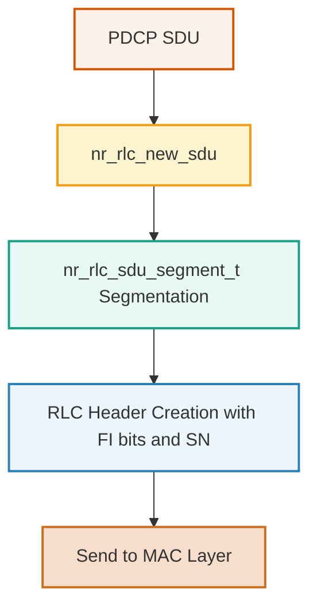

```mermaid
flowchart TD
    A[PDCP SDU] --> B[nr_rlc_new_sdu]
    B --> C[nr_rlc_sdu_segment_t Segmentation]
    C --> D[RLC Header Creation with FI bits and SN]
    D --> E[Send to MAC Layer]

    style A fill:#fdf2e9,stroke:#d35400,stroke-width:2px
    style B fill:#fcf3cf,stroke:#f39c12,stroke-width:2px
    style C fill:#e8f8f5,stroke:#16a085,stroke-width:2px
    style D fill:#ebf5fb,stroke:#2980b9,stroke-width:2px
    style E fill:#f6ddcc,stroke:#ca6f1e,stroke-width:2px

```
